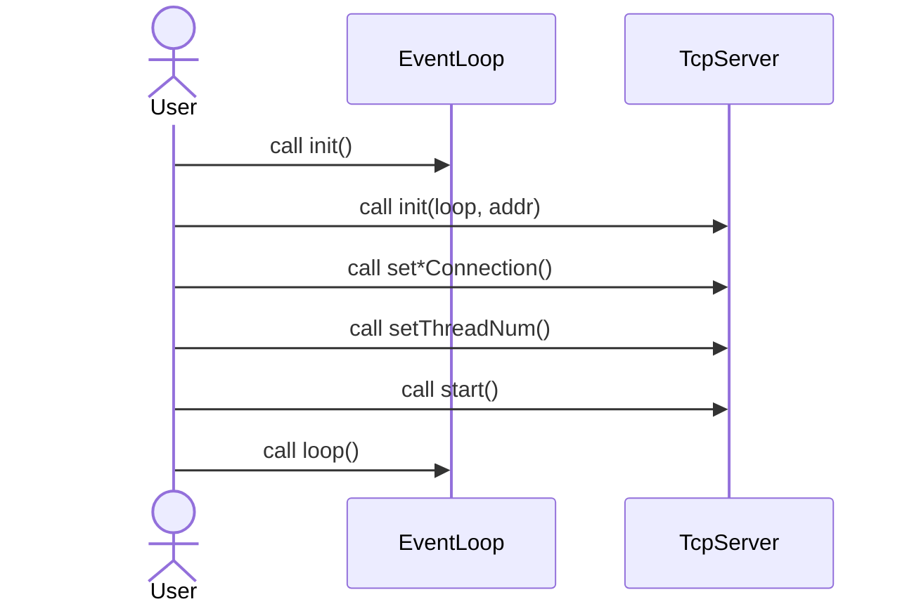
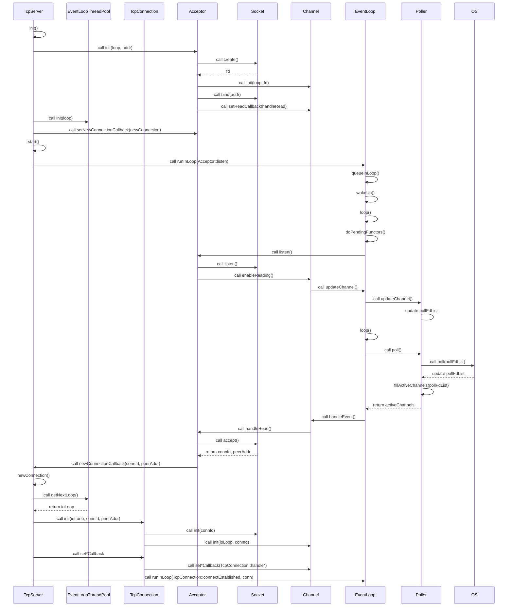
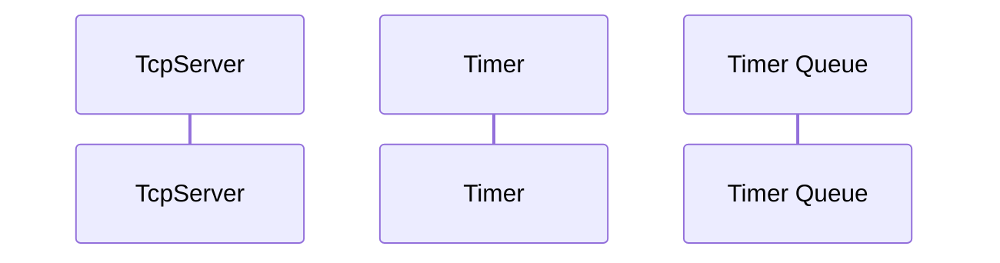

# Tiny Muduo

## Overview


### For User


### For TcpServer


### Timer


## Setup
```shell
sudo apt install build-essential cmake libboost-dev
```

## Reference
https://github.com/chenshuo/recipes